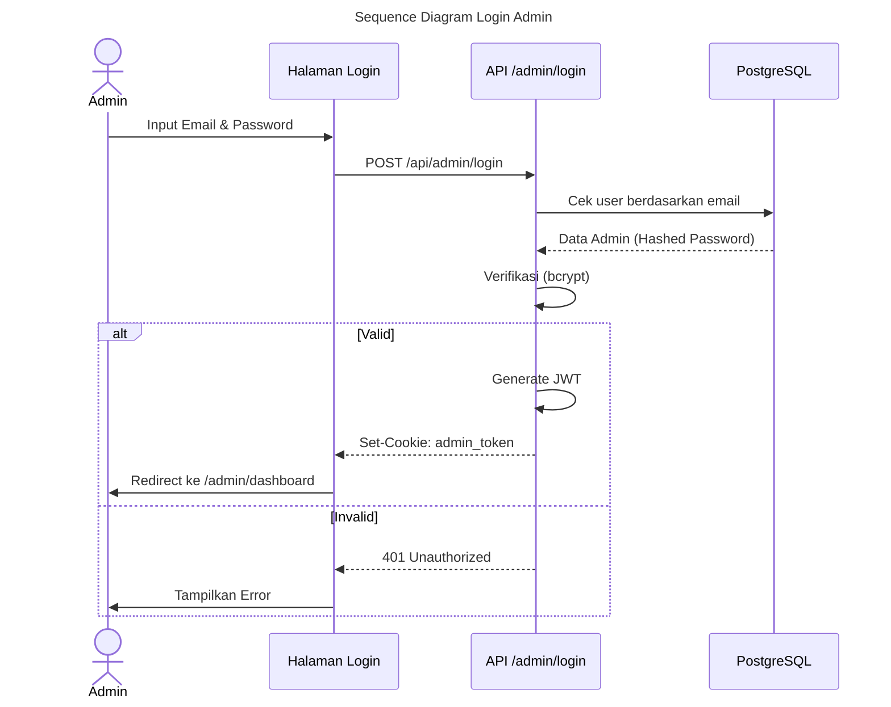

<!--
DOCUMENT METADATA
File       : AUTHENTICATION.md
Version    : 1.0.0
Generated  : 2026-08-08
Source     : Dianalisis dari source code project
Verified   : src/middleware.ts, src/app/api/admin/login/route.ts
-->

# AUTHENTICATION.md

> **Status Verifikasi**: ✅ Fully Verified
> **Sumber Utama**: `src/middleware.ts`, `src/app/api/admin/login/route.ts`

---

## Mekanisme Otentikasi Admin
Aplikasi ini menggunakan skema autentikasi kustom berbasis **JSON Web Tokens (JWT)** yang disimpan dalam format **HTTP-Only Cookies** untuk melindungi area admin. 

### Alur Login
1. Pengguna memasukkan kredensial (Email & Password) pada form `/admin/login`.
2. Frontend menembak `POST /api/admin/login`.
3. Backend melakukan verifikasi:
   - Mencari data admin di tabel `Admin` menggunakan Prisma.
   - Melakukan hash comparison menggunakan `bcryptjs`.
4. Jika valid, backend men-generate JWT (ditandatangani dengan rahasia `JWT_SECRET` menggunakan library `jose`).
5. JWT diset sebagai cookie `admin_token` dalam respons, lalu pengguna diarahkan ke `/admin/dashboard`.

### Proteksi Middleware (Edge Network)
File `src/middleware.ts` bertanggung jawab mengamankan rute secara global:
- **Matcher**: Aktif untuk setiap rute yang cocok dengan `/admin/:path*`.
- **Pengecualian**: URL `/admin/login` dibiarkan terbuka (NextResponse.next) agar tidak terjadi redirect loop.
- **Validasi**:
  1. Middleware membaca cookie `admin_token`.
  2. Jika token tidak ada, request ditolak dan user di-redirect ke `/admin/login`.
  3. Jika token ada, middleware memanggil utilitas `verifyToken` (berbasis library `jose`) untuk mengecek signature dan expiration time JWT.
  4. Jika invalid/kadaluarsa, cookie dihapus secara paksa, dan user di-redirect ke login.
  5. Jika valid, proses dilanjutkan.

## Pertimbangan Keamanan (Security Notes)
- Tidak ada autentikasi untuk akses publik (baca halaman, scan QR, kirim karya). Otorisasi diserahkan sepenuhnya ke sistem kurasi di mana karya harus berstatus `APPROVED` (oleh admin) agar muncul di antarmuka publik.
- Penggunaan library `jose` penting dalam ekosistem Next.js App Router karena standard `jsonwebtoken` (Node.js) tidak kompatibel dengan Edge Runtime yang digunakan Middleware.
