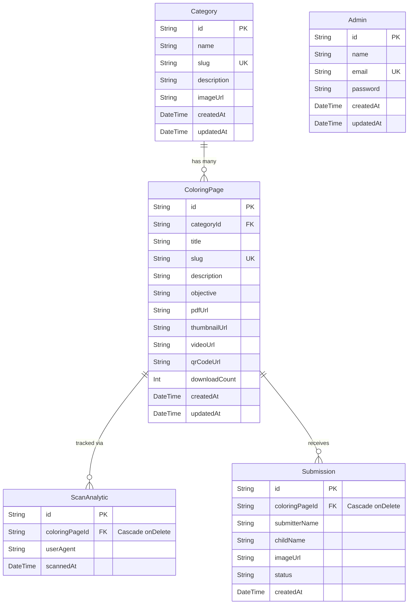

<!--
DOCUMENT METADATA
File       : ERD.md
Version    : 1.0.0
Generated  : 2026-08-08
Source     : Dianalisis dari source code project
Verified   : prisma/schema.prisma
-->

# ERD.md

> **Status Verifikasi**: ✅ Fully Verified
> **Sumber Utama**: `prisma/schema.prisma`

---

## Entity Relationship Diagram

Diagram berikut merepresentasikan relasi antar tabel pada sistem database EduColoring Web.

## Keterangan Relasi
1. **Category (1) -> (N) ColoringPage**: Satu kategori (misalnya "Hewan") dapat memiliki banyak halaman mewarnai. Field penghubung: `ColoringPage.categoryId`.
2. **ColoringPage (1) -> (N) ScanAnalytic**: Setiap halaman mewarnai dapat discan berkali-kali, menghasilkan banyak baris analitik. Jika `ColoringPage` dihapus, `ScanAnalytic` terkait akan terhapus otomatis (`Cascade`).
3. **ColoringPage (1) -> (N) Submission**: Satu halaman mewarnai dapat diselesaikan oleh banyak anak. Jika `ColoringPage` dihapus, `Submission` terkait akan terhapus (`Cascade`).
4. **Admin**: Merupakan tabel independen yang tidak memiliki relasi Foreign Key (FK) secara langsung dengan entitas lain, murni untuk fungsi manajemen sesi.
