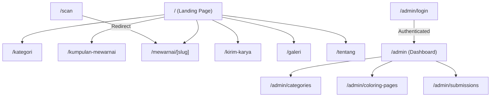

<!--
DOCUMENT METADATA
File       : FLOWCHART.md
Version    : 1.0.0
Generated  : 2026-08-08
Source     : Ekstraksi dari PROJECT_OVERVIEW dan PAGE_DOCUMENTATION
-->

# FLOWCHART.md

> **Catatan Tambahan**: File ini merupakan kompilasi diagram Flowchart yang mendeskripsikan logika aplikasi, dikumpulkan secara khusus untuk memudahkan pembacaan alur sistem.

---

## 1. Flowchart Alur Penggunaan Aplikasi (Data Flow)
Diagram ini menggambarkan perjalanan pengguna (user journey) dari awal hingga karyanya berhasil dipublikasikan di galeri.

```mermaid
flowchart TD
    A([Mulai]) --> B[Pengguna Mengunduh Gambar Cetak]
    B --> C[Pengguna Mewarnai Secara Fisik]
    C --> D{Apakah scan QR code?}
    D -- Ya --> E[Sistem mencatat ScanAnalytic]
    E --> F[Tampil Video Referensi Animasi]
    D -- Tidak --> G[Pengguna mengirim hasil karya (Kirim Karya)]
    F --> G
    
    G --> H[Data Karya tersimpan di DB status: PENDING]
    H --> I[Admin meninjau karya di Dashboard]
    I --> J{Keputusan Moderasi}
    J -- Reject --> K[Status menjadi REJECTED (Tidak Tampil)]
    J -- Approve --> L[Status menjadi APPROVED]
    
    L --> M([Karya Tampil di Halaman Galeri Publik])
```

---

## 2. Flowchart Peta Situs (Sitemap Navigation)
Diagram ini memetakan jalur rute (URL) yang bisa diakses oleh pengunjung publik maupun admin.


