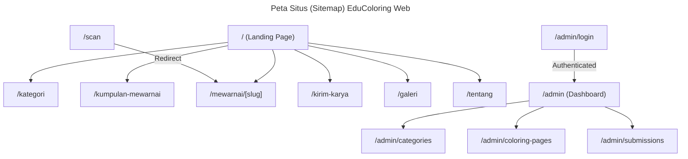

<!--
DOCUMENT METADATA
File       : PAGE_DOCUMENTATION.md
Version    : 1.0.0
Generated  : 2026-08-08
Source     : Dianalisis dari source code project
Verified   : src/app/
-->

# PAGE_DOCUMENTATION.md

> **Status Verifikasi**: ✅ Fully Verified
> **Sumber Utama**: Struktur `src/app`

---

## Pemetaan Halaman (Pages Routing)

Next.js App Router memetakan folder menjadi route. Berikut adalah dokumentasi halaman yang tersedia di aplikasi EduColoring Web.

### 1. Halaman Publik
- **`/` (Root/Landing Page)**: 
  - **File**: `src/app/page.tsx`
  - **Fungsi**: Halaman sambutan utama. Menyajikan nilai-nilai aplikasi, highlight kategori unggulan, dan efek "WOW" menggunakan background animasi / blob Glassmorphism.

- **`/kategori`**:
  - **File**: `src/app/kategori/page.tsx`
  - **Fungsi**: Daftar lengkap kategori halaman mewarnai yang tersedia (contoh: Hewan, Pemandangan, Karakter).

- **`/kumpulan-mewarnai`**:
  - **File**: `src/app/kumpulan-mewarnai/page.tsx`
  - **Fungsi**: Halaman eksplorasi yang menampilkan katalog lengkap objek mewarnai yang bisa difilter.

- **`/mewarnai/[slug]`**:
  - **File**: `src/app/mewarnai/page.tsx` (atau dynamic routing)
  - **Fungsi**: Halaman detail spesifik untuk satu gambar. Menampilkan tombol Unduh Gambar cetak, Preview Image, dan integrasi video referensi (berjalan secara 3D/animatif).

- **`/scan`**:
  - **File**: `src/app/scan/page.tsx`
  - **Fungsi**: Halaman perantara ketika sebuah QR Code pada lembar fisik dipindai. Bertugas mencatat analitik, lalu me-redirect ke halaman `/mewarnai/[slug]` yang sesuai.

- **`/kirim-karya`**:
  - **File**: `src/app/kirim-karya/page.tsx`
  - **Fungsi**: Formulir agar pengguna (anak/orang tua) dapat berpartisipasi dengan mengunggah hasil mewarnai fisik yang sudah selesai. Data diunggah ke DB dengan status `PENDING`.

- **`/galeri`**:
  - **File**: `src/app/galeri/page.tsx`
  - **Fungsi**: Galeri publik yang hanya menampilkan Submission (karya) dengan status `APPROVED`.

- **`/tentang`**:
  - **File**: `src/app/tentang/page.tsx`
  - **Fungsi**: Penjelasan mengenai latar belakang proyek dan tim pengembang (misalnya dari KKN).

### 2. Halaman Admin (Protected Routes)
- **`/admin/login`**: Halaman otentikasi.
- **`/admin/...`**: Folder dashboard tertutup. Terdiri dari sub-halaman untuk melihat statistik (Dashboard), mengatur kategori, daftar Coloring Pages, dan melakukan approval/rejection Submission. Seluruh tata letaknya mengikuti pakem dashboard yang menggunakan komponen sidebar kustom (komponen Admin).

## Peta Situs (Sitemap Flowchart)

