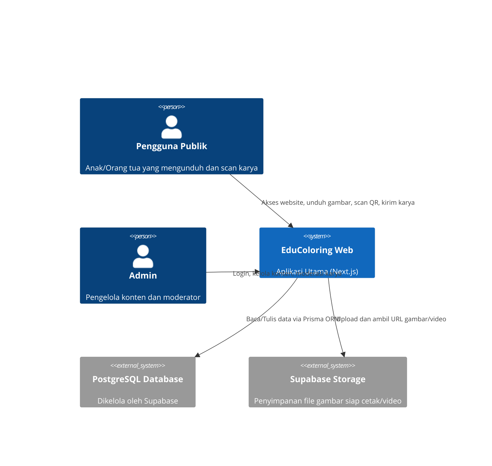

<!--
DOCUMENT METADATA
File       : SYSTEM_ARCHITECTURE.md
Version    : 1.0.0
Generated  : 2026-08-08
Source     : Dianalisis dari source code project
Verified   : src/app, prisma/schema.prisma, src/middleware.ts
-->

# SYSTEM_ARCHITECTURE.md

> **Status Verifikasi**: ✅ Fully Verified
> **Sumber Utama**: `src/app`, `prisma/schema.prisma`, `src/middleware.ts`

---

## 1. Pola Arsitektur
Proyek ini mengadopsi pola **Monolithic (Serverless) Architecture** khas Next.js App Router:
- **Frontend & Backend** disatukan dalam satu repositori (Next.js).
- Next.js menangani perenderan halaman melalui Server Components (SSR/SSG) secara default, dan Client Components (CSR) jika interaktivitas dibutuhkan (misal animasi Three.js).
- Fungsi backend berjalan sebagai Route Handlers (`src/app/api`) yang bersifat Serverless Functions ketika di-deploy di Vercel atau sejenisnya.

## 2. Diagram Konteks C4 (Tingkat Tinggi)

## 3. Alur Keamanan (Authentication)
Aplikasi hanya memiliki sistem otentikasi untuk panel Admin:
- **Middleware**: File `src/middleware.ts` memproteksi semua rute yang diawali dengan `/admin` (kecuali `/admin/login`) dengan memverifikasi keberadaan dan keabsahan token JWT di cookies (`admin_token`).
- **Verifikasi**: Fungsi internal menggunakan library `jose` untuk memvalidasi JWT secara ringan di edge runtime.

## 4. Layering Interaksi Database
- **Controller/API Route**: `src/app/api/.../route.ts` menerima request HTTP.
- **ORM Layer**: Memanggil modul `PrismaClient` yang diinisialisasi di `src/lib/prisma.ts` (asumsi konvensi umum) untuk melakukan operasi CRUD.
- **Database**: Terhubung ke PostgreSQL (pooler Supabase) menggunakan Transaction Mode (`DATABASE_URL`).
